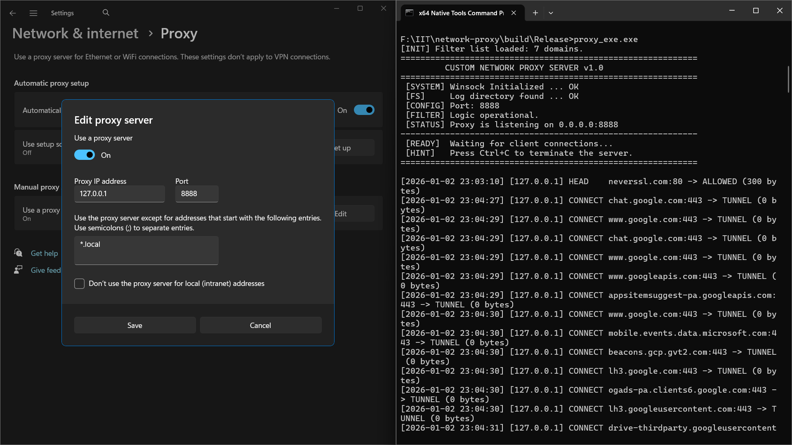
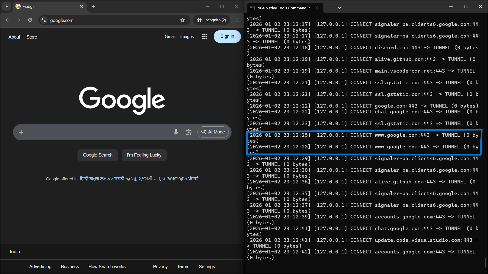

# Test Artifacts: Proxy Server Execution Audit

## 1. Test Environment Summary
- **Date of Execution:** 2026-01-02
- **Proxy Endpoint:** 127.0.0.1:8888
- **Test Tool:** Automated Batch Suite (`test_proxy.bat`) & Manual Curl Verification
- **Log Source:** `logs/proxy.log`

## 2. Log Format Specification
The proxy server generates a synchronized, thread-safe audit trail in a CSV-compatible format for easy post-processing and analysis.

| Column | Description |
| :--- | :--- |
| **Timestamp** | ISO-8601 formatted date and time of request |
| **Client IP** | The IPv4 address of the connecting client |
| **Target Host** | The destination domain or IP requested |
| **Method** | HTTP Verb (GET, HEAD, POST) or CONNECT for HTTPS |
| **Action** | Outcome: `ALLOWED` (Forwarded), `BLOCKED` (Filtered), or `TUNNEL` (HTTPS) |
| **Bytes** | Total payload size transferred from remote server to client |

## 3. Captured Test Logs
The following data was captured during the execution of the automated test suite. It demonstrates successful HTTP forwarding, HTTPS tunneling, domain filtering, and handling of concurrent requests.

```csv
2026-01-02 22:35:02,127.0.0.1,[www.google.com](https://www.google.com),GET,ALLOWED,21373
2026-01-02 22:35:14,127.0.0.1,www.wikipedia.org,CONNECT,TUNNEL,0
2026-01-02 22:35:15,127.0.0.1,example.com,HEAD,BLOCKED,0
2026-01-02 22:35:18,127.0.0.1,[www.bing.com](https://www.bing.com),GET,BLOCKED,0
2026-01-02 22:35:29,127.0.0.1,[www.google.com](https://www.google.com),HEAD,ALLOWED,1066
2026-01-02 22:37:59,127.0.0.1,[www.google.com](https://www.google.com),GET,ALLOWED,21333
2026-01-02 23:03:10,127.0.0.1,neverssl.com,HEAD,ALLOWED,300
2026-01-02 23:04:52,127.0.0.1,api.github.com,CONNECT,TUNNEL,0
2026-01-02 23:05:15,127.0.0.1,bing.com,CONNECT,BLOCKED,0
2026-01-02 23:05:40,127.0.0.1,api2.cursor.sh,CONNECT,TUNNEL,0
2026-01-02 23:05:43,127.0.0.1,www.google.com,CONNECT,TUNNEL,0

## Screenshot A: System Integration
**Description:** Evidence that the Windows Operating System is successfully routing network traffic through the custom C++ Proxy Server.


*Note: Shown above is the Windows Proxy Settings configured to 127.0.0.1:8888 alongside the active Proxy Server console.*

---

## Screenshot B: Security Filtering (Domain Blocking)
**Description:** Verification of the $O(\log N)$ filtering engine. The proxy intercepts requests to blacklisted domains and returns a custom HTTP 403 Forbidden response.


*Note: The browser displays the "Access Denied" message while the console logs the 'BLOCKED' action for the specific domain.*

---

## Screenshot C: HTTPS CONNECT Tunneling
**Description:** Evidence of successful Layer 4 tunneling. This allows the proxy to handle encrypted traffic (TLS/SSL) for sites like Google and GitHub without compromising end-to-end encryption.


*Note: The browser successfully loads a secure site (HTTPS) while the console displays multiple 'TUNNEL' status entries.*