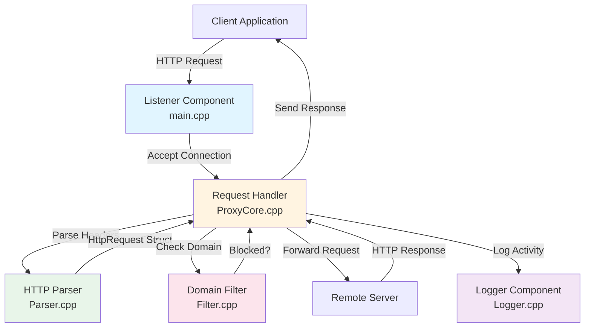

# System Design Document

## High-Level Architecture

The proxy server follows a **layered request-handling architecture** with clear separation of concerns. The system is composed of five primary components that process HTTP requests through distinct stages: connection acceptance, parsing, filtering, forwarding, and logging.



### Component Responsibilities

| Component | File | Primary Responsibility | Key Functions |
|-----------|------|------------------------|---------------|
| **Listener** | `src/main.cpp` | Server initialization, connection acceptance, thread spawning | `main()`, `ctrl_handler()` |
| **Request Handler** | `src/ProxyCore.cpp` | Orchestrates request lifecycle, socket management, request/response forwarding | `handleClient()`, `connectToRemote()`, `sendAll()`, `setSocketTimeout()` |
| **HTTP Parser** | `src/Parser.cpp` | HTTP request parsing, header extraction, request modification | `recvHeaders()`, `parseHttpRequest()`, `modifyRequestLine()` |
| **Domain Filter** | `src/Filter.cpp` | Blocklist management, domain matching (exact and subdomain) | `loadFilters()`, `isBlocked()`, `normalize()` |
| **Logger** | `src/Logger.cpp` | Request logging to console and file | `logProxy()` |

### Component Interactions

1. **Listener → Request Handler**: The listener accepts incoming connections and spawns detached threads, each executing `handleClient()` with a unique client socket.

2. **Request Handler → Parser**: The handler calls `recvHeaders()` to read HTTP headers from the client socket, then `parseHttpRequest()` to extract structured request data into an `HttpRequest` struct.

3. **Request Handler → Filter**: After parsing, the handler queries `isBlocked()` with the extracted hostname. The filter performs case-insensitive matching against a `std::set<std::string>` of blocked domains.

4. **Request Handler → Logger**: Upon request completion (blocked or forwarded), the handler invokes `logProxy()` with request metadata. The logger writes to both console and `proxy.log` file.

5. **Request Handler → Remote Server**: For allowed requests, the handler establishes a TCP connection to the remote host, forwards the modified request, and streams the response back to the client.

## Concurrency Model

The system employs a **thread-per-connection** model with detached threads. Each accepted client connection spawns a new `std::thread` that is immediately detached, allowing the main listener loop to continue accepting new connections without blocking.

### Implementation Details

```cpp
// From main.cpp:57-62
while (true) {
    SOCKET client = accept(listenSock, NULL, NULL);
    if (client != INVALID_SOCKET) {
        std::thread(handleClient, client).detach();
    }
}
```

### Rationale

**Why thread-per-connection was chosen:**

1. **Simplicity**: The model requires minimal synchronization logic. Each thread operates on independent socket pairs (client and remote), eliminating shared state contention for request processing.

2. **Blocking I/O Compatibility**: The system uses synchronous WinSock2 calls (`recv()`, `send()`, `connect()`). Thread-per-connection allows blocking operations without stalling other requests.

3. **Windows Platform**: On Windows, thread creation overhead is relatively low compared to Unix systems, making this model more viable for moderate concurrency levels.

4. **Development Speed**: This approach avoids the complexity of event loops, completion ports, or thread pools, enabling rapid prototyping.

### Trade-offs

**Advantages:**
- **Low latency**: No queuing or scheduling delays; requests are processed immediately upon acceptance
- **Isolation**: Thread crashes or hangs affect only a single connection
- **Straightforward debugging**: Each request has a dedicated thread stack, simplifying stack traces

**Disadvantages:**
- **Scalability bottleneck**: Thread creation overhead and memory consumption (default 1MB stack per thread on Windows) limit concurrent connections. The system can handle hundreds, not thousands, of simultaneous connections.
- **Resource exhaustion risk**: No connection limit enforcement. Under high load, the system may exhaust thread or socket resources.
- **No connection reuse**: Detached threads cannot be pooled or reused, increasing system overhead.

### Thread Safety Mechanisms

The system uses **mutex-based synchronization** for shared resources:

| Resource | Mutex | Protected Operations |
|----------|-------|---------------------|
| Console output | `coutMtx` | Prevents interleaved log messages in `handleClient()` |
| Blocklist | `filterMtx` | Protects `blockedDomains` set during reads and writes |
| Log file | `logMtx` | Ensures atomic writes to `proxy.log` |

**Critical Section Analysis:**

- **Filter reads**: `isBlocked()` acquires `filterMtx` for the entire lookup operation. This is conservative but safe, as lookups are O(log n) for `std::set`.
- **Console logging**: Each log statement in `handleClient()` uses `coutMtx`, preventing message corruption but potentially serializing output under high concurrency.
- **File logging**: `logProxy()` opens and closes the log file on each call, which is inefficient but ensures data integrity without file handle management.

### Alternative Models Considered

**Thread Pool**: Would require a queue and worker thread management. Rejected due to added complexity and the need for non-blocking I/O or queue management.

**Event Loop (IOCP on Windows)**: Would provide superior scalability but requires significant architectural changes, including completion port setup and callback-based I/O handling.

## Data Flow

### Request Lifecycle

The following describes the complete path of an HTTP request through the system:

#### 1. Connection Acceptance (`main.cpp:57-62`)

- The listener blocks on `accept()` until a client connects
- Upon acceptance, a new `SOCKET` descriptor is obtained
- A detached thread is spawned with `std::thread(handleClient, client).detach()`
- The main loop immediately returns to `accept()` for the next connection

#### 2. Client Socket Configuration (`ProxyCore.cpp:46-47`)

- `setSocketTimeout()` configures the client socket with a 7-second receive/send timeout
- This prevents threads from blocking indefinitely on unresponsive clients

#### 3. Client IP Extraction (`ProxyCore.cpp:49-54`)

- `getpeername()` retrieves the client's socket address
- `inet_ntop()` converts the binary address to a human-readable IP string
- Used later for logging purposes

#### 4. Header Reception (`ProxyCore.cpp:56-62`)

- `recvHeaders()` reads data from the client socket in 1024-byte chunks
- Accumulates data until the HTTP header terminator `\r\n\r\n` is found
- Enforces an 8KB maximum header size to prevent memory exhaustion
- Returns the total bytes received or an error code

#### 5. HTTP Parsing (`ProxyCore.cpp:64-68`)

- `parseHttpRequest()` extracts structured data from the raw HTTP string:
  - **Request line**: Method, path, and HTTP version via string splitting
  - **Host header**: Extracts hostname and optional port (defaults to "80")
- Returns an `HttpRequest` struct containing parsed fields
- If parsing fails (empty host), the connection is closed

#### 6. Domain Filtering (`ProxyCore.cpp:70-80`)

- `isBlocked()` performs case-insensitive hostname normalization
- Checks for exact match in `blockedDomains` set (O(log n))
- Performs subdomain matching: if host is `ad.doubleclick.net` and `doubleclick.net` is blocked, the request is blocked
- If blocked:
  - Sends `HTTP_403` response to client
  - Logs the blocked request
  - Closes the connection and thread exits

#### 7. Remote Connection Establishment (`ProxyCore.cpp:87-94`)

- `connectToRemote()` uses `getaddrinfo()` for DNS resolution and socket creation
- Attempts TCP connection to the resolved address
- On failure, sends `502 Bad Gateway` to client and exits
- On success, configures remote socket with a 10-second timeout

#### 8. Request Modification (`ProxyCore.cpp:98-99`)

- `modifyRequestLine()` reconstructs the HTTP request:
  - Preserves the original request line (method, path, version)
  - Forces `Connection: close` and `Proxy-Connection: close` headers
  - This disables HTTP keep-alive, ensuring each request uses a new connection
- The modified request is sent to the remote server via `sendAll()`

#### 9. Response Streaming (`ProxyCore.cpp:101-106`)

- Reads response data from remote socket in 16KB chunks
- Immediately forwards each chunk to the client using `sendAll()`
- `sendAll()` handles partial sends by looping until all bytes are transmitted
- Accumulates `totalBytes` for logging
- Loop terminates on `recv()` error or EOF

#### 10. Logging and Cleanup (`ProxyCore.cpp:108-116`)

- `logProxy()` writes request metadata to console and `proxy.log`:
  - Client IP, host, port, method, path, status ("ALLOWED"), bytes transferred
- Both sockets (client and remote) are closed
- Thread exits, resources are automatically cleaned up

### Data Structures

**`HttpRequest` struct** (`Common.h:12-19`):
- Contains parsed HTTP request components
- `raw` field preserves original request for modification
- `port` is stored as `std::string` to handle non-numeric ports (though current implementation assumes numeric)

**`blockedDomains`** (`Filter.cpp:10`):
- `std::set<std::string>` provides O(log n) lookup and automatic deduplication
- Loaded once at startup from `blocked.txt`
- Thread-safe access via `filterMtx`

### Error Handling Flow

The system uses **fail-fast error handling** with early returns:

1. **Socket errors**: `INVALID_SOCKET` checks trigger immediate connection closure
2. **Parse failures**: Empty hostname results in silent connection drop
3. **Header size limits**: Exceeding 8KB returns error code `-2`, connection closed
4. **Remote connection failures**: `502 Bad Gateway` sent to client
5. **I/O errors**: `sendAll()` and `recv()` errors break loops and close sockets

**Notable gaps**: No retry logic, no error logging beyond console output, no metrics collection for error rates.

## Operational Considerations

### Error Handling Strategies

**Socket-Level Errors:**

- **Connection failures**: `connectToRemote()` returns `INVALID_SOCKET` on DNS or connection errors. The handler responds with `502 Bad Gateway` and closes the client connection.
- **Send failures**: `sendAll()` returns `SOCKET_ERROR` on partial send failures, breaking the response streaming loop. The connection is closed, but no error is reported to the client (response may be incomplete).
- **Receive timeouts**: Socket timeouts (7s client, 10s remote) prevent indefinite blocking. On timeout, `recv()` returns 0 or error, terminating the connection.

**Parsing Errors:**

- **Malformed requests**: `parseHttpRequest()` returns an `HttpRequest` with empty `host` if parsing fails. The handler checks `req.host.empty()` and silently closes the connection.
- **Oversized headers**: `recvHeaders()` enforces an 8KB limit. Exceeding this returns `-2`, and the connection is closed without response.

**Resource Exhaustion:**

- **Thread exhaustion**: No limit on concurrent threads. Under sustained load, the system may exhaust available threads or memory.
- **File handle leaks**: `logProxy()` opens `proxy.log` on each call without explicit closing (relies on RAII). Under extreme concurrency, this may exhaust file handles.
- **Socket exhaustion**: No connection limit enforcement. The system relies on OS-level socket limits.

### Known System Limitations

**Scalability Bottlenecks:**

1. **Thread-per-connection overhead**: Each connection consumes ~1MB stack space and thread creation overhead. Practical limit: ~500-1000 concurrent connections on typical hardware.

2. **Synchronous I/O**: Blocking `recv()` and `send()` operations prevent efficient multiplexing. A single slow client or remote server can consume a thread for the entire request duration.

3. **No connection pooling**: Each request creates a new remote connection. High-frequency requests to the same host waste connection setup overhead.

4. **Single-threaded listener**: The main `accept()` loop is single-threaded. Under extreme load, connection acceptance may become a bottleneck.

**Functional Limitations:**

1. **HTTP-only**: No HTTPS/SSL/TLS support. The system cannot handle encrypted traffic or CONNECT method for tunneling.

2. **No request body handling**: The parser only processes headers. POST/PUT requests with bodies may be truncated or malformed during forwarding.

3. **Header modification limitations**: `modifyRequestLine()` only handles `Connection` and `Proxy-Connection` headers. Other headers (e.g., `Via`, `X-Forwarded-For`) are not added.

4. **Blocklist reload**: The blocklist is loaded once at startup. Changes to `blocked.txt` require server restart.

5. **No authentication**: The proxy accepts connections from any client without authentication or authorization checks.

**Performance Characteristics:**

- **Memory**: Linear growth with concurrent connections (~1MB per thread stack)
- **CPU**: Context switching overhead increases with thread count
- **Network**: No connection reuse increases latency for repeated requests to the same host

### Security Considerations

**Current Security Posture:**

1. **Input validation**: Minimal. Hostname extraction uses simple string parsing without validation against RFC 3986. Malformed hostnames may cause DNS resolution failures but are not sanitized.

2. **No rate limiting**: The system accepts unlimited connections from any IP address. Vulnerable to connection exhaustion attacks.

3. **No authentication**: Any client can use the proxy without credentials. Suitable only for trusted networks.

4. **Header injection risks**: `modifyRequestLine()` performs string replacement without validating header format. Malicious headers could potentially be injected, though the current implementation is relatively safe.

5. **File system access**: `loadFilters()` and `logProxy()` access the file system without path validation. Relative paths could be exploited if the working directory is compromised.

6. **No encryption**: All traffic is unencrypted. Sensitive data should not pass through this proxy.

**Recommended Security Enhancements:**

- Implement connection rate limiting per IP address
- Add proxy authentication (Basic or Digest)
- Validate and sanitize all parsed input
- Use absolute paths for configuration and log files
- Implement request size limits (total request size, not just headers)
- Add IP whitelist/blacklist functionality
- Consider implementing HTTPS support for production use

### Monitoring and Observability

**Current Logging:**

- Console output: Real-time status messages (`[FORWARD]`, `[BLOCKED]`, `[DONE]`)
- File logging: CSV format in `proxy.log` with request metadata

**Missing Observability:**

- No metrics collection (request rate, error rate, latency)
- No structured logging (JSON format)
- No health check endpoint
- No connection count monitoring
- No resource usage tracking (memory, threads, sockets)

**Operational Recommendations:**

- Implement periodic metrics export (e.g., requests/second, blocked requests, average response time)
- Add structured logging with log levels (INFO, WARN, ERROR)
- Monitor thread count and socket usage
- Implement graceful shutdown with connection draining
- Add configuration reload capability without restart

