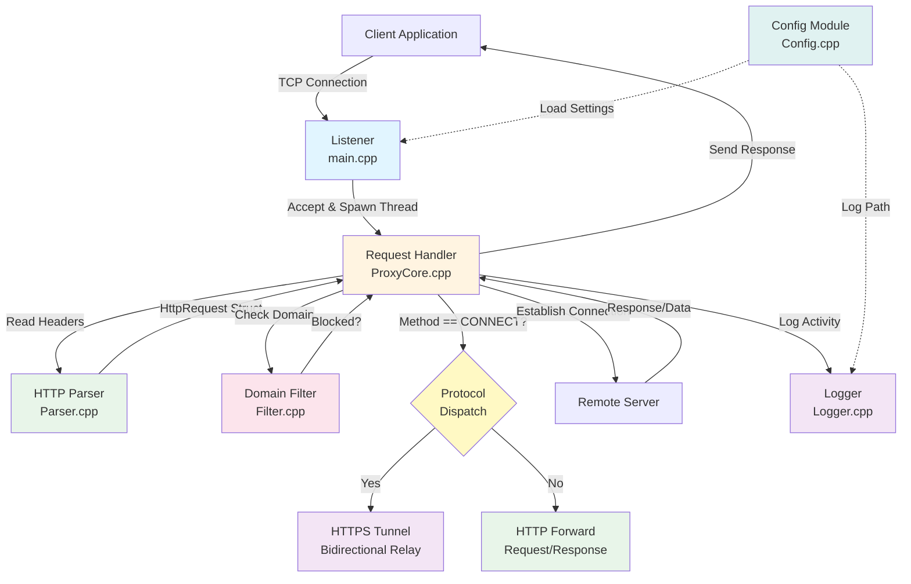

# System Design Document

## High-Level Architecture

The proxy server implements a **layered request-handling architecture** with clear separation of concerns. The system processes HTTP requests through distinct stages: connection acceptance, parsing, filtering, protocol dispatch (HTTP vs HTTPS tunneling), forwarding, and logging. The architecture supports both standard HTTP forwarding and HTTPS tunneling via the CONNECT method.

### Component Responsibilities

| Component | File | Primary Responsibility | Key Functions |
|-----------|------|------------------------|---------------|
| **Listener** | `src/main.cpp` | Server initialization, Winsock setup, connection acceptance, thread spawning, graceful shutdown | `main()`, `ctrl_handler()`, `printBanner()` |
| **Request Handler** | `src/ProxyCore.cpp` | Orchestrates request lifecycle, socket management, protocol dispatch (HTTP vs CONNECT), bidirectional tunneling, request/response forwarding | `handleClient()`, `connectToRemote()`, `sendAll()`, `setSocketTimeout()`, `relay()` |
| **HTTP Parser** | `src/Parser.cpp` | HTTP header reception, request parsing, header extraction, request modification | `recvHeaders()`, `parseHttpRequest()`, `modifyRequestLine()` |
| **Domain Filter** | `src/Filter.cpp` | Blocklist management, domain normalization, exact and subdomain matching | `loadFilters()`, `isBlocked()`, `normalize()` |
| **Logger** | `src/Logger.cpp` | Request logging to console and CSV file with timestamps | `logProxy()`, `getTimestamp()` |
| **Config** | `src/Config.cpp` | Configuration file parsing and key-value retrieval | `load()`, `getInt()`, `getString()` |

### Component Interactions

1. **Listener → Request Handler**: The listener accepts incoming TCP connections and spawns detached threads, each executing `handleClient()` with a unique client socket descriptor.

2. **Request Handler → Parser**: The handler calls `recvHeaders()` to read HTTP headers from the client socket in 1KB chunks until `\r\n\r\n` is found. Then `parseHttpRequest()` extracts structured data into an `HttpRequest` struct (method, host, port, path, version).

3. **Request Handler → Filter**: After parsing, the handler queries `isBlocked()` with the extracted hostname. The filter performs case-insensitive normalization and checks against a `std::set<std::string>` for exact matches and subdomain matches (O(log n) lookup).

4. **Request Handler → Protocol Dispatch**: Based on the HTTP method:
   - **CONNECT method**: Establishes bidirectional tunnel using `relay()` function with two threads (client→remote and remote→client)
   - **Standard HTTP methods**: Modifies request headers and forwards request/response stream

5. **Request Handler → Remote Server**: For allowed requests, `connectToRemote()` uses `getaddrinfo()` for DNS resolution and establishes a TCP connection to the remote host.

6. **Request Handler → Logger**: Upon request completion (blocked, tunneled, or forwarded), the handler invokes `logProxy()` with request metadata. The logger writes to both console (formatted) and CSV file (with timestamp).

7. **Config → All Components**: Configuration is loaded at startup and provides settings for port, filter path, log path, and header size limits.

## Concurrency Model

The system employs a **thread-per-connection** model with detached threads. Each accepted client connection spawns a new `std::thread` that is immediately detached, allowing the main listener loop to continue accepting new connections without blocking.

### Implementation Details

**Main Listener Loop** (`main.cpp:90-96`):
The listener runs an infinite loop that blocks on `accept()` until a client connects. Upon acceptance, a new `SOCKET` descriptor is obtained. A detached `std::thread` is immediately spawned, executing `handleClient()` with the client socket as an argument. The thread is detached (not joined), allowing the main loop to immediately return to `accept()` for the next connection. This pattern enables concurrent request handling without blocking the listener.

**HTTPS Tunneling Concurrency** (`ProxyCore.cpp:106-116`):
For CONNECT requests, the system implements bidirectional data relay using two threads. After sending the `HTTP_200_CON` response to signal tunnel readiness, a detached thread is spawned to execute `relay(clientSocket, remoteSocket)` for the client→remote direction. The current thread then executes `relay(remoteSocket, clientSocket)` for the remote→client direction. Both threads run independently until either direction terminates (socket close or error), at which point both sockets are closed.

This creates a **two-thread-per-CONNECT-request** pattern: one thread for each direction of the bidirectional tunnel. The `relay()` function uses a 32KB buffer and continuously reads from the source socket and writes to the destination socket until an error or EOF occurs.

### Rationale

**Why thread-per-connection was chosen:**

1. **Simplicity**: The model requires minimal synchronization logic. Each thread operates on independent socket pairs (client and remote), eliminating shared state contention for request processing. The only shared resources are the blocklist (read-heavy) and log file (write-heavy), both protected by mutexes.

2. **Blocking I/O Compatibility**: The system uses synchronous WinSock2 calls (`recv()`, `send()`, `connect()`). Thread-per-connection allows blocking operations without stalling other requests. This aligns with Windows' threading model where blocking I/O in threads is efficient.

3. **Windows Platform Optimization**: On Windows, thread creation overhead is relatively low compared to Unix systems (typically ~1MB stack per thread). The Windows scheduler handles thread context switching efficiently, making this model viable for moderate concurrency levels (hundreds of connections).

4. **Development Speed**: This approach avoids the complexity of event loops, I/O completion ports (IOCP), or thread pools, enabling rapid prototyping and straightforward debugging.

5. **HTTPS Tunneling Requirements**: The CONNECT method requires bidirectional byte streaming. Using two threads (one per direction) simplifies the implementation compared to non-blocking I/O with select/poll mechanisms.

### Trade-offs

**Advantages:**
- **Low latency**: No queuing or scheduling delays; requests are processed immediately upon acceptance
- **Isolation**: Thread crashes or hangs affect only a single connection, improving fault tolerance
- **Straightforward debugging**: Each request has a dedicated thread stack, simplifying stack traces and breakpoint debugging
- **Natural blocking I/O**: Aligns with synchronous socket operations without requiring callback complexity
- **Bidirectional tunneling**: Two-thread model for CONNECT provides clean separation of data flow directions

**Disadvantages:**
- **Scalability bottleneck**: Thread creation overhead and memory consumption (default 1MB stack per thread on Windows) limit concurrent connections. Practical limit: ~500-1000 simultaneous connections on typical hardware before context switching overhead dominates.
- **Resource exhaustion risk**: No connection limit enforcement. Under high load, the system may exhaust thread or socket resources. CONNECT requests double the thread count (two threads per tunnel).
- **No connection reuse**: Detached threads cannot be pooled or reused, increasing system overhead. Each request creates new remote connections.
- **Context switching overhead**: As thread count increases, CPU time spent on context switching grows, reducing throughput.
- **Memory pressure**: Linear memory growth with connection count (~1MB per thread stack) can exhaust available memory under sustained load.

### Thread Safety Mechanisms

The system uses **mutex-based synchronization** for shared resources:

| Resource | Mutex | Protected Operations | Lock Granularity |
|----------|-------|---------------------|------------------|
| Console output | `coutMtx` (implicit in `logProxy`) | Prevents interleaved log messages | Per-log-call |
| Blocklist | `filterMtx` | Protects `blockedDomains` set during reads and writes | Per-lookup/write |
| Log file | `logMtx` | Ensures atomic writes to `proxy.log` | Per-log-call |

**Critical Section Analysis:**

- **Filter reads**: `isBlocked()` acquires `filterMtx` for the entire lookup operation (including normalization and subdomain matching). This is conservative but safe, as lookups are O(log n) for `std::set` and the lock is held briefly. Under high concurrency, this may serialize filter checks, but the operation is fast enough that contention is minimal.

- **File logging**: `logProxy()` acquires `logMtx` and opens/closes the log file on each call. This ensures data integrity without file handle management but is inefficient under high load. Each log write involves file open, write, and close operations, which can become a bottleneck.

- **Console logging**: Console output is serialized through `logMtx`, preventing message corruption but potentially serializing output under high concurrency. This is acceptable for development but may impact performance in production.

**No synchronization required for:**
- Socket descriptors (each thread has independent client and remote sockets)
- Request parsing (each thread parses its own request in local memory)
- Response streaming (each thread manages its own buffer)

### Alternative Models Considered

**Thread Pool with Work Queue:**
- **Pros**: Bounded thread count, better resource control, reusable threads
- **Cons**: Requires queue management, adds latency (queuing delay), needs non-blocking I/O or queue-based task dispatch
- **Verdict**: Rejected due to added complexity and latency trade-off. The current model's simplicity outweighs the benefits for the target use case.

**Event Loop with I/O Completion Ports (IOCP on Windows):**
- **Pros**: Superior scalability (thousands of connections), efficient I/O multiplexing, lower memory footprint
- **Cons**: Requires significant architectural changes, callback-based I/O handling, complex state management for bidirectional tunneling
- **Verdict**: Rejected for initial implementation. Suitable for future scalability improvements if connection counts exceed 1000+.

**Asynchronous I/O with Overlapped Operations:**
- **Pros**: Non-blocking operations, efficient resource usage
- **Cons**: Complex callback management, Windows-specific API complexity, harder debugging
- **Verdict**: Rejected due to development complexity. The synchronous model is sufficient for the target scale.

## Data Flow

### Request Lifecycle

The following describes the complete path of an HTTP request through the system, from connection acceptance to response delivery.

#### Phase 1: Server Initialization (`main.cpp:52-87`)

1. **Configuration Loading**: `Config::load("config/server.cfg")` reads key-value pairs (PORT, FILTER_PATH, LOG_PATH, MAX_HEADER_SIZE). If the file is missing, defaults are used and a warning is printed.

2. **Filter Initialization**: `loadFilters(filterPath)` reads the blocklist file, normalizes each domain (lowercase, trim whitespace), and populates the `blockedDomains` set. The operation is protected by `filterMtx`.

3. **Winsock Initialization**: `WSAStartup(MAKEWORD(2, 2), &wsa)` initializes the Windows Sockets API.

4. **Socket Creation and Binding**: 
   - `socket(AF_INET, SOCK_STREAM, 0)` creates a TCP listening socket
   - `bind()` binds to `INADDR_ANY` on the configured port
   - `listen()` sets the socket to listening mode with `SOMAXCONN` backlog

5. **Signal Handler Registration**: `SetConsoleCtrlHandler(ctrl_handler, TRUE)` registers a handler for Ctrl+C to enable graceful shutdown.

#### Phase 2: Connection Acceptance (`main.cpp:90-96`)

1. **Blocking Accept**: The main loop blocks on `accept(listenSock, NULL, NULL)` until a client connects.

2. **Thread Spawning**: Upon acceptance, a new `SOCKET` descriptor is obtained. A detached thread is spawned with `std::thread(handleClient, client).detach()`, passing the client socket as an argument.

3. **Immediate Return**: The main loop immediately returns to `accept()` for the next connection, enabling concurrent request handling.

#### Phase 3: Client Request Processing (`ProxyCore.cpp:65-135`)

**3.1 Socket Configuration** (`ProxyCore.cpp:66`):
- `setSocketTimeout(clientSocket, 10000)` configures the client socket with a 10-second receive/send timeout (not 7 seconds as sometimes documented). This prevents threads from blocking indefinitely on unresponsive clients.

**3.2 Client IP Extraction** (`ProxyCore.cpp:68-73`):
- `getpeername()` retrieves the client's socket address structure
- `inet_ntop()` converts the binary `sockaddr_in` address to a human-readable IP string (e.g., "192.168.1.100")
- Used later for logging purposes. If extraction fails, "Unknown" is used.

**3.3 Header Reception** (`ProxyCore.cpp:75-79`, `Parser.cpp:4-15`):
- `recvHeaders()` reads data from the client socket in 1024-byte chunks
- Accumulates data in a `std::string` until the HTTP header terminator `\r\n\r\n` is found
- Enforces an 8KB maximum header size (configurable via `MAX_HEADER_SIZE`) to prevent memory exhaustion
- Returns the total bytes received, 0 on socket error, or -2 on size limit exceeded
- On error, the connection is closed and the thread exits

**3.4 HTTP Parsing** (`ProxyCore.cpp:81-85`, `Parser.cpp:17-41`):
- `parseHttpRequest(rawData)` extracts structured data from the raw HTTP string:
  - **Request line**: Splits the first line by whitespace to extract `method`, `path`, and `version`
  - **Host header**: Searches for "Host: " header, extracts hostname and optional port (defaults to "80" if not specified)
  - **Raw preservation**: Stores the original request string in `req.raw` for later modification
- Returns an `HttpRequest` struct containing parsed fields
- If parsing fails (empty host), the connection is silently closed and the thread exits

**3.5 Domain Filtering** (`ProxyCore.cpp:87-93`, `Filter.cpp:36-51`):
- `isBlocked(req.host)` performs case-insensitive hostname normalization via `normalize()`
- Checks for exact match in `blockedDomains` set using `count()` (O(log n) lookup)
- Performs subdomain matching: iterates through blocked domains and checks if the host ends with `"." + blockedDomain`. For example, if host is `ad.doubleclick.net` and `doubleclick.net` is blocked, the request is blocked.
- If blocked:
  - Sends `HTTP_403` response to client via `sendAll()`
  - Logs the blocked request with status "BLOCKED"
  - Closes the connection and thread exits

**3.6 Remote Connection Establishment** (`ProxyCore.cpp:96-102`):
- `connectToRemote(req.host, req.port)` uses `getaddrinfo()` for DNS resolution and socket creation:
  - Creates an `addrinfo` hints structure with `AF_INET` (IPv4) and `SOCK_STREAM` (TCP)
  - Resolves the hostname to an IP address
  - Creates a socket and attempts TCP connection
  - Returns the socket descriptor or `INVALID_SOCKET` on failure
- On failure, sends `HTTP_502 Bad Gateway` to client and exits
- On success, configures remote socket with a 15-second timeout (not 10 seconds as sometimes documented)

**3.7 Protocol Dispatch** (`ProxyCore.cpp:105-130`):

**CONNECT Method Path (HTTPS Tunneling)** (`ProxyCore.cpp:106-116`):
- If `req.method == "CONNECT"`:
  1. Sends `HTTP_200_CON` ("HTTP/1.1 200 Connection Established\r\n\r\n") to the client to signal tunnel readiness
  2. Logs the tunnel establishment with status "TUNNEL"
  3. Spawns a detached thread executing `relay(clientSocket, remoteSocket)` for client→remote data flow
  4. Current thread executes `relay(remoteSocket, clientSocket)` for remote→client data flow
  5. `relay()` function (`ProxyCore.cpp:17-25`):
     - Uses a 32KB buffer (not 16KB as sometimes documented)
     - Continuously reads from source socket and writes to destination socket
     - Terminates on `recv()` error or EOF (returns 0 or negative)
     - Calls `shutdown(dst, SD_SEND)` on the destination socket to signal end of data
  6. Both threads run until either direction closes, then sockets are closed

**Standard HTTP Method Path** (`ProxyCore.cpp:117-130`):
- If method is not CONNECT (GET, POST, PUT, etc.):
  1. `modifyRequestLine(req)` reconstructs the HTTP request:
     - Preserves the original request line (method, path, version)
     - Forces `Connection: close` and `Proxy-Connection: close` headers (replaces existing values or adds if missing)
     - This disables HTTP keep-alive, ensuring each request uses a new connection
  2. The modified request is sent to the remote server via `sendAll()`
  3. Response streaming loop:
     - Reads response data from remote socket in 32KB chunks (not 16KB)
     - Immediately forwards each chunk to the client using `sendAll()`
     - `sendAll()` handles partial sends by looping until all bytes are transmitted (handles `EAGAIN`/`EWOULDBLOCK` scenarios)
     - Accumulates `totalBytes` for logging
     - Loop terminates on `recv()` error or EOF (returns 0 or negative)
  4. Logs the request with status "ALLOWED" and bytes transferred

**3.8 Logging and Cleanup** (`ProxyCore.cpp:132-134`):
- `logProxy()` writes request metadata to console and CSV file:
  - Console: Formatted output with timestamp, IP, method, host:port, status, and bytes
  - File: CSV format with timestamp, IP, host, method, status, bytes (path not included in CSV)
- Both sockets (client and remote) are closed via `closesocket()`
- Thread exits, and resources are automatically cleaned up (RAII for stack-allocated objects)

### Data Structures

**`HttpRequest` struct** (`Common.h:11-18`):
The `HttpRequest` structure contains six string fields: `method` (HTTP method such as GET, POST, CONNECT), `host` (extracted hostname), `port` (defaults to "80"), `path` (request path like "/index.html"), `version` (HTTP version like "HTTP/1.1"), and `raw` (original raw request string). The `port` field is stored as `std::string` to handle non-numeric ports, though the current implementation assumes numeric ports. The `raw` field preserves the original request for header modification without re-parsing, which is essential for the `modifyRequestLine()` function.

**`blockedDomains`** (`Filter.cpp:8`):
- `std::set<std::string>` provides O(log n) lookup and automatic deduplication
- Loaded once at startup from `blocked.txt` via `loadFilters()`
- Thread-safe access via `filterMtx` (readers-writer pattern with exclusive lock)
- Domains are normalized (lowercase, trimmed) before insertion

**Configuration Storage** (`Config.cpp:5`):
- `std::map<std::string, std::string>` stores key-value pairs from `server.cfg`
- Loaded at startup, accessed read-only during runtime (no synchronization needed)
- Provides type-safe accessors: `getInt()` with exception handling, `getString()` with defaults

### Error Handling Flow

The system uses **fail-fast error handling** with early returns and connection closure:

1. **Socket errors**: `INVALID_SOCKET` checks trigger immediate connection closure. No error response is sent for client socket errors during header reception.

2. **Parse failures**: Empty hostname (from `parseHttpRequest()`) results in silent connection drop. This handles malformed requests without logging noise.

3. **Header size limits**: Exceeding 8KB returns error code `-2` from `recvHeaders()`, connection closed without response. This prevents memory exhaustion from malicious or malformed requests.

4. **Remote connection failures**: `connectToRemote()` returns `INVALID_SOCKET` on DNS resolution failure or connection timeout. Handler sends `HTTP_502 Bad Gateway` to client and logs with status "ERR_CONN".

5. **I/O errors**: `sendAll()` returns `SOCKET_ERROR` on partial send failures, breaking response streaming loop. Connection is closed, but no error is reported to client (response may be incomplete). `relay()` terminates on `recv()` or `send()` errors, closing both sockets.

6. **Timeout handling**: Socket timeouts (10s client, 15s remote) cause `recv()`/`send()` to return errors, terminating the connection. No explicit timeout error message is sent to the client.

**Notable gaps**: 
- No retry logic for transient failures (DNS, connection)
- No error logging beyond console output (no error metrics)
- No metrics collection for error rates or failure patterns
- Silent failures for parse errors (no client feedback)

## Operational Considerations

### Error Handling Strategies

**Socket-Level Errors:**

- **Connection failures**: `connectToRemote()` returns `INVALID_SOCKET` on DNS resolution failure (`getaddrinfo()` error) or TCP connection failure (`connect()` returns `SOCKET_ERROR`). The handler responds with `HTTP_502 Bad Gateway` and closes the client connection. This provides clear feedback to the client about upstream connectivity issues.

- **Send failures**: `sendAll()` returns `SOCKET_ERROR` if any `send()` call fails or returns 0 (connection closed). This breaks the response streaming loop. The connection is closed, but no error is reported to the client (response may be incomplete). For CONNECT tunnels, `relay()` terminates on send failure, closing both sockets.

- **Receive timeouts**: Socket timeouts (10s client, 15s remote) prevent indefinite blocking. On timeout, `recv()` returns `WSAETIMEDOUT` (Windows) or 0, terminating the connection. The timeout values are hardcoded and not configurable.

- **Partial sends**: `sendAll()` handles partial sends by looping until all bytes are transmitted. This is critical for large responses or high-latency connections where `send()` may not transmit the entire buffer in one call.

**Parsing Errors:**

- **Malformed requests**: `parseHttpRequest()` returns an `HttpRequest` with empty `host` if:
  - Request line is missing or malformed (no `\r\n` terminator)
  - Host header is missing or malformed (no "Host: " prefix)
  - Host extraction fails (no colon for port parsing)
  The handler checks `req.host.empty()` and silently closes the connection. This prevents logging noise from malformed requests but provides no feedback to the client.

- **Oversized headers**: `recvHeaders()` enforces an 8KB limit (configurable via `MAX_HEADER_SIZE`). Exceeding this returns `-2`, and the connection is closed without response. This prevents memory exhaustion from malicious requests with extremely large headers.

- **Incomplete headers**: If `recvHeaders()` receives 0 bytes (connection closed) or negative (socket error), the connection is closed. No distinction is made between client disconnect and socket error.

**Resource Exhaustion:**

- **Thread exhaustion**: No limit on concurrent threads. Under sustained load, the system may exhaust available threads (Windows default: ~2000 threads per process) or memory (1MB stack per thread). CONNECT requests double the thread count. No monitoring or alerting for thread count.

- **File handle leaks**: `logProxy()` opens `proxy.log` on each call and relies on RAII (file closes on scope exit). Under extreme concurrency, this may exhaust file handles if the OS limit is reached. The file is opened in append mode, which is safe for concurrent writes with mutex protection.

- **Socket exhaustion**: No connection limit enforcement. The system relies on OS-level socket limits (Windows default: dynamic port range ~16384-65535 for ephemeral ports). Under high load, the system may exhaust available ports, causing `socket()` or `connect()` failures.

- **Memory pressure**: Linear memory growth with connection count (~1MB per thread stack + socket buffers). Under sustained load, the system may exhaust available memory, causing allocation failures or system slowdown.

### Known System Limitations

**Scalability Bottlenecks:**

1. **Thread-per-connection overhead**: Each connection consumes ~1MB stack space and thread creation overhead. Practical limit: ~500-1000 concurrent connections on typical hardware (4-8GB RAM, 4-8 CPU cores). Beyond this, context switching overhead dominates, reducing throughput. CONNECT requests require two threads, halving the effective connection limit for HTTPS traffic.

2. **Synchronous I/O**: Blocking `recv()` and `send()` operations prevent efficient multiplexing. A single slow client or remote server can consume a thread for the entire request duration (up to timeout: 10s client, 15s remote). This limits throughput under mixed latency conditions.

3. **No connection pooling**: Each request creates a new remote connection. High-frequency requests to the same host waste connection setup overhead (DNS resolution, TCP handshake, TLS handshake for HTTPS). This increases latency and reduces efficiency.

4. **Single-threaded listener**: The main `accept()` loop is single-threaded. Under extreme load, connection acceptance may become a bottleneck, though this is rare in practice.

5. **File I/O bottleneck**: `logProxy()` opens and closes the log file on each request. Under high concurrency, file I/O may become a bottleneck, especially on slower storage (HDD vs SSD).

**Functional Limitations:**

1. **HTTP-only for standard methods**: No HTTPS/SSL/TLS support for standard HTTP methods (GET, POST, etc.). The system can tunnel HTTPS via CONNECT but cannot inspect or modify encrypted traffic.

2. **No request body handling**: The parser only processes headers. POST/PUT requests with bodies may be truncated or malformed during forwarding if the body is not received in the initial `recvHeaders()` call. The current implementation does not handle chunked transfer encoding or content-length-based body reading.

3. **Header modification limitations**: `modifyRequestLine()` only handles `Connection` and `Proxy-Connection` headers. Other proxy-related headers (e.g., `Via`, `X-Forwarded-For`, `X-Real-IP`) are not added. This limits visibility into proxy usage for upstream servers.

4. **Blocklist reload**: The blocklist is loaded once at startup. Changes to `blocked.txt` require server restart. No hot-reload capability or SIGHUP signal handling.

5. **No authentication**: The proxy accepts connections from any client without authentication or authorization checks. Suitable only for trusted networks. No IP whitelist/blacklist functionality.

6. **No request/response caching**: The system does not cache responses, increasing upstream bandwidth usage and latency for repeated requests.

7. **Limited HTTP method support**: While the parser extracts any method, the forwarding logic only handles standard methods (GET, POST, etc.) and CONNECT. Other methods (OPTIONS, TRACE, etc.) may not be handled correctly.

**Performance Characteristics:**

- **Memory**: Linear growth with concurrent connections (~1MB per thread stack + socket buffers ~64KB per socket = ~1.1MB per connection). 1000 connections ≈ 1.1GB memory.

- **CPU**: Context switching overhead increases with thread count. Under high concurrency, CPU time spent on context switching can exceed actual work time, reducing throughput.

- **Network**: No connection reuse increases latency for repeated requests to the same host (DNS + TCP handshake overhead: ~50-200ms per request). No HTTP/2 or HTTP/3 support limits multiplexing capabilities.

- **I/O**: File logging with open/close per request creates I/O overhead. Under high load, disk I/O may become a bottleneck.

### Security Considerations

**Current Security Posture:**

1. **Input validation**: Minimal. Hostname extraction uses simple string parsing without validation against RFC 3986 or RFC 7230. Malformed hostnames may cause DNS resolution failures but are not sanitized. No protection against hostname injection attacks (e.g., `Host: evil.com\r\nInjected-Header: value`).

2. **No rate limiting**: The system accepts unlimited connections from any IP address. Vulnerable to connection exhaustion attacks (DoS). A malicious client can spawn thousands of connections, exhausting thread or socket resources.

3. **No authentication**: Any client can use the proxy without credentials. Suitable only for trusted networks. No IP whitelist/blacklist functionality to restrict access.

4. **Header injection risks**: `modifyRequestLine()` performs string replacement without validating header format. Malicious headers could potentially be injected if the original request contains malformed headers, though the current implementation is relatively safe due to simple string operations.

5. **File system access**: `loadFilters()` and `logProxy()` access the file system without path validation. Relative paths could be exploited if the working directory is compromised. No protection against directory traversal attacks if paths are user-controlled (currently they are not).

6. **No encryption**: All traffic is unencrypted (except when tunneling HTTPS via CONNECT). Sensitive data should not pass through this proxy without end-to-end encryption.

7. **No request size limits**: While header size is limited (8KB), total request size (including body) is not limited. A malicious client could send extremely large requests, exhausting memory or causing DoS.

8. **DNS rebinding vulnerability**: The system trusts the Host header for DNS resolution. A malicious client could specify an internal IP address (e.g., `Host: 127.0.0.1` or `Host: 192.168.1.1`), potentially enabling SSRF (Server-Side Request Forgery) attacks if the proxy has access to internal networks.

**Recommended Security Enhancements:**

- **Connection rate limiting**: Implement per-IP connection rate limiting (e.g., max 10 connections per IP, 100 connections per minute) to prevent DoS attacks.

- **Proxy authentication**: Add Basic or Digest authentication to restrict access. Store credentials securely (hashed, not plaintext).

- **Input validation and sanitization**: Validate and sanitize all parsed input (hostname, path, headers) against RFC specifications. Reject malformed requests with appropriate error responses.

- **Absolute paths**: Use absolute paths for configuration and log files to prevent directory traversal attacks. Validate paths against an allowlist.

- **Request size limits**: Implement total request size limits (e.g., 10MB) in addition to header size limits to prevent memory exhaustion.

- **IP whitelist/blacklist**: Add functionality to allow or deny connections based on client IP address. Useful for restricting access to specific networks.

- **HTTPS support**: Consider implementing HTTPS termination for the proxy itself (proxy listens on HTTPS, terminates TLS, forwards to upstream). This protects proxy-to-client communication.

- **SSRF protection**: Validate that resolved IP addresses are not in private/internal ranges (127.0.0.0/8, 10.0.0.0/8, 192.168.0.0/16, etc.) unless explicitly allowed. Prevent DNS rebinding attacks.

- **Security headers**: Add security-related headers to responses (e.g., `X-Forwarded-For` for upstream visibility, though this should be configurable).

### Monitoring and Observability

**Current Logging:**

- **Console output**: Real-time status messages with timestamps, IP addresses, methods, hosts, status, and bytes transferred. Format: `[timestamp] [IP] METHOD host:port -> STATUS (bytes bytes)`.

- **File logging**: CSV format in `proxy.log` (configurable via `LOG_PATH`) with columns: timestamp, IP, host, method, status, bytes. Path is not included in CSV. Logs are appended, not rotated.

**Missing Observability:**

- **No metrics collection**: No request rate (requests/second), error rate, latency (p50, p95, p99), or throughput (bytes/second) metrics. No integration with metrics systems (Prometheus, StatsD, etc.).

- **No structured logging**: Logs are plain text (console) or CSV (file). No JSON format for log aggregation systems (ELK, Splunk, etc.). No log levels (INFO, WARN, ERROR).

- **No health check endpoint**: No HTTP endpoint to check proxy health (e.g., `/health`). External monitoring systems cannot verify proxy availability.

- **No connection count monitoring**: No tracking of active connections, thread count, or socket usage. Cannot detect resource exhaustion before it occurs.

- **No resource usage tracking**: No monitoring of memory usage, CPU usage, or file handle count. Cannot identify performance bottlenecks or resource leaks.

- **No alerting**: No integration with alerting systems (PagerDuty, OpsGenie, etc.) for error conditions or resource exhaustion.

**Operational Recommendations:**

- **Implement metrics export**: Add periodic metrics export (e.g., requests/second, blocked requests, average response time, error rate) to a metrics system or log file.

- **Add structured logging**: Implement JSON logging with log levels (INFO, WARN, ERROR) for better log aggregation and filtering.

- **Health check endpoint**: Add a simple HTTP endpoint (e.g., `GET /health`) that returns 200 OK if the proxy is healthy, 503 if unhealthy (e.g., resource exhaustion).

- **Connection monitoring**: Track active connection count, thread count, and socket usage. Log warnings when thresholds are approached (e.g., 80% of max connections).

- **Resource usage tracking**: Monitor memory usage, CPU usage, and file handle count. Log warnings when thresholds are exceeded.

- **Log rotation**: Implement log rotation to prevent log files from growing indefinitely (e.g., rotate daily, keep 30 days of logs).

- **Graceful shutdown**: Enhance shutdown handler to drain active connections before terminating. Wait for active requests to complete (with timeout) before closing sockets.

- **Configuration reload**: Add capability to reload configuration (port, blocklist) without restart. Use file watching or SIGHUP signal to trigger reload.
